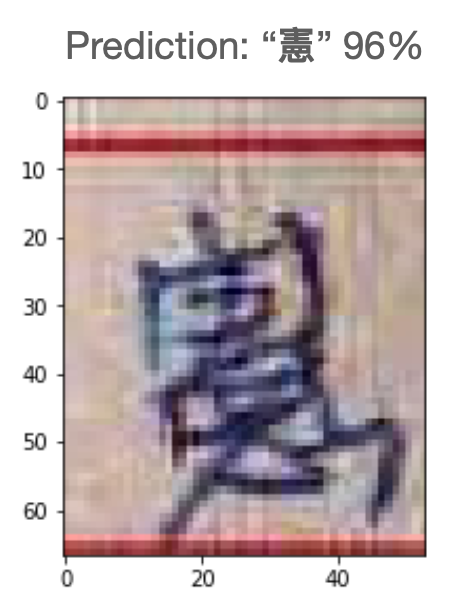

# T-brain 2021 夏季賽，中文手寫影像辨識：Top 4% Solution
- 競賽名稱：玉山人工智慧挑戰賽 2021 夏季賽 - 「你，識字嗎？」中文手寫影像辨識
- 競賽網址：https://tbrain.trendmicro.com.tw/Competitions/Details/14
- 競賽簡述：本次競賽提供參賽者手寫中文字圖檔，期望透過深度學習自動辨識圖片中的文字，以大幅降低人力處理重複性作業的成本。

## 參賽成績
- Team: StarRingChild
  - 隊員名單：[冠豪](https://github.com/KuanHaoHuang/)、[冠廷](https://github.com/alexlautw9527)、[銘翔](https://github.com/kuo23)、[彥庭](https://github.com/SuYenTing/)
- Rank: 20th / 468 teams (Top 4%)
- Macro-Average F1-score: 0.9311

## Git Repo 說明
- make_handwriting_image_tutorial.ipynb ([Google Colab 開啟](https://colab.research.google.com/github/KuanHaoHuang/tbrain-esun-handwriting-recognition/blob/main/make_handwriting_image_tutorial.ipynb)): 合成手寫圖片教學
- train_model.ipynb ([Google Colab 開啟](https://colab.research.google.com/github/KuanHaoHuang/tbrain-esun-handwriting-recognition/blob/main/train_model.ipynb)): 主要模型訓練流程
- inference_test.ipynb ([Google Colab 開啟](https://colab.research.google.com/github/KuanHaoHuang/tbrain-esun-handwriting-recognition/blob/main/inference_test.ipynb)): 以測試集資料比較隊伍內不同模型成效
- images 資料夾內圖片僅是教學示範使用，並非真實競賽資料，原始資料請洽詢 [主辦單位](https://tbrain.trendmicro.com.tw/Competitions/Details/14)

## [部落格文章（競賽心得、得獎者技巧筆記、手寫圖片合成教學）](https://haosquare.com/tbrain-esun-handwriting-recognition/)

## 比賽技巧簡述
- VGG 風格的深度學習模型（[參考研究](http://cs231n.stanford.edu/reports/2016/pdfs/257_Report.pdf)）
- 多種資料增強，包含：scale、rotate、RGB shift、Gaussian blur 等等
- 特殊資料增強：引入多項外部開源資料集，進行**中文手寫影像合成**，將原資料集的空白背景與手寫圖片或印刷體合成（請參考 [教學](https://colab.research.google.com/github/KuanHaoHuang/tbrain-esun-handwriting-recognition/blob/main/make_handwriting_image_tutorial.ipynb)）
  - 手寫圖片：[AI Free Team 繁體中文手寫資料集](https://github.com/AI-FREE-Team/Traditional-Chinese-Handwriting-Dataset)
  - 手寫圖片：[kirosc/chinese-calligraphy-dataset](https://github.com/kirosc/chinese-calligraphy-dataset/)
  - 手寫圖片：[kmnist](http://codh.rois.ac.jp/kmnist/)
  - 印刷體字型：[Google Noto Sans CJK](https://www.google.com/get/noto/help/cjk/)
  - 印刷體字型：[全字庫](https://www.cns11643.gov.tw/)
- 承上，刻意加入不屬於預測目標（競賽規定之 800 字）的其他中文字合成圖片，增加對「其他類別」（"isnull"）的預測準確率
- 部分訓練資料手動修改標籤錯誤
- 隊伍協作：ResNet 與 VGG 兩種模型輸出的簡單平均 Ensemble
- Python Flask + Google Cloud 部署 API（[Flask 程式碼](https://github.com/SuYenTing/esun_2021_ai_competition)）
  
